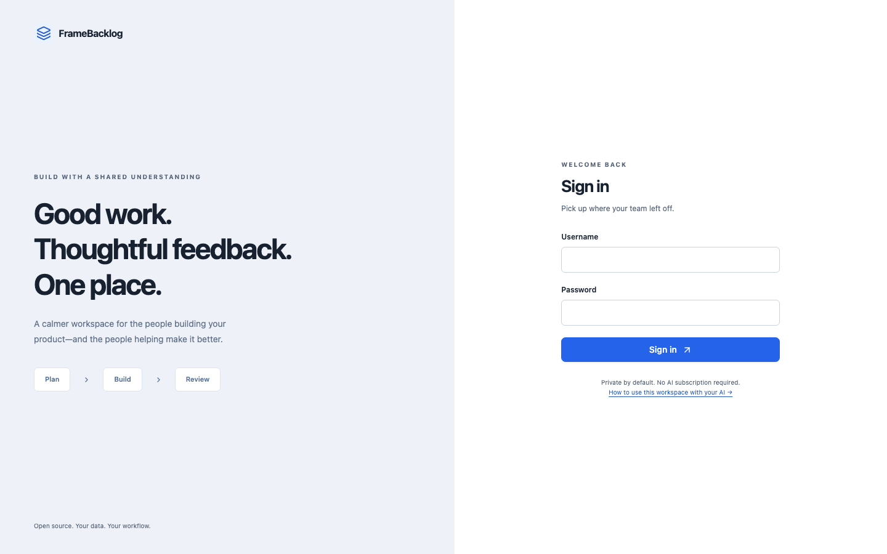

# FrameBacklog

> A calm, shared workspace for planning work, building product journeys, and collecting human feedback.

<p align="center">
  <a href="https://custombacklog.medimemhamdi18.workers.dev/">
    
  </a>
</p>

<p align="center">
  <a href="https://custombacklog.medimemhamdi18.workers.dev/">Open the live workspace ↗</a>
  ·
  <a href="https://custombacklog.medimemhamdi18.workers.dev/guide">Read the in-app guide ↗</a>
  ·
  <a href="https://github.com/imemdev/framebacklog">View the source ↗</a>
</p>

FrameBacklog keeps the product conversation in one place: a backlog for requirements, a visual screen journey for what users see, versioned screenshots for review, and a secure REST API for coding assistants. It does not require an embedded chatbot or an LLM subscription.

The project was previously named **CustomBacklog**. The visible application name is configurable with `NEXT_PUBLIC_APP_NAME`; existing `CUSTOMBACKLOG_*` integration variables and storage identifiers remain supported.

## What it helps with

- **Plan** — organize projects, ideas, tasks, acceptance criteria, priorities, dependencies, and assignees.
- **Build** — map a user journey on a visual canvas, connect screens in an intentional direction, and play the journey at one second per screen.
- **Review** — upload, replace, or remove screen images; keep screenshot versions; add pinned feedback; and record human review decisions.
- **Collaborate** — invite a partner with project-scoped permissions and keep each project private by default.
- **Automate** — create a project-scoped API token and use the REST API or the local MCP adapter without exposing browser sessions.

## Live deployment

The current public deployment runs on Cloudflare Workers with Cloudflare D1 for structured data and R2 for screenshot files:

- **Application:** [custombacklog.medimemhamdi18.workers.dev](https://custombacklog.medimemhamdi18.workers.dev/)
- **User guide:** [live `/guide` page](https://custombacklog.medimemhamdi18.workers.dev/guide)
- **OpenAPI document:** [live `/api/openapi` endpoint](https://custombacklog.medimemhamdi18.workers.dev/api/openapi)

The production root and OpenAPI endpoint have been smoke-tested after deployment. Cloudflare usage limits and billing remain account-level responsibilities.

## Start locally

Use Node 24.15+ and pnpm 11.19.0. Node 26.8.2 was used for the current local verification.

```sh
git clone https://github.com/imemdev/framebacklog.git
cd framebacklog
corepack enable
pnpm install --frozen-lockfile
cp .env.example .env.local
```

Set `BETTER_AUTH_SECRET` to a random value of at least 32 characters and keep `.env.local` private:

```sh
openssl rand -hex 32
```

Then start the guided local launcher:

```sh
./scripts/framebacklog.sh
```

The launcher applies SQLite migrations, starts the development server, and opens [http://localhost:3000](http://localhost:3000) when the app is ready. Keep that terminal open and press **Ctrl+C** to stop the server and its child processes.

The first person to register becomes the owner. The owner can create a project and invite a partner from **Settings → People**. To use fixed local credentials, set `LOCAL_OWNER_USERNAME` and `LOCAL_OWNER_PASSWORD` in the private `.env.local`; the launcher will create or update that local owner while retaining project data.

## Product flow

| Stage | What happens |
| --- | --- |
| **Plan** | Capture ideas and turn them into tasks with priorities, dependencies, acceptance criteria, and assignees. |
| **Build** | Add screens, optionally place the first screenshot directly in Version 1, and connect screens on the journey canvas. |
| **Review** | Replace or remove images, keep version-specific feedback, approve a screen, or request changes. |
| **Share** | Give a partner only the project actions they need, or create a scoped token for an external assistant. |

## Architecture

```text
Browser
  │
  ▼
Next.js application
  │
  ├─ Local mode       → SQLite + local screenshot files
  │
  └─ Cloudflare mode  → Worker + D1 metadata + R2 screenshots
                         └─ REST API / OpenAPI / MCP adapter
```

The same domain model is used locally and in the Cloudflare deployment. Server-side authorization checks project membership and action grants before every protected mutation. Screenshot replacement and deletion clean up the associated object after the metadata update succeeds.

## Cloudflare deployment

After configuring Wrangler, D1, R2, and the production `APP_URL`, build and deploy the OpenNext worker:

```sh
pnpm cf:build
pnpm exec opennextjs-cloudflare deploy
```

The repository configuration uses the `DB` D1 binding for application data and the `SCREENSHOTS` R2 binding for uploaded images. Never commit `.env.local`, API secrets, private screenshots, databases, or browser authentication state.

## Use an external assistant

Under **Settings → AI access**, create a named project-scoped token, copy its secret once, and download the secret-free connection kit. Test the connection before leaving the secret screen.

- [Agent quick-start](docs/AGENT_QUICKSTART.md) — a small consumer guide.
- [People and product guide](docs/USER_GUIDE.md) — backlog, review, journeys, and invitations.
- [MCP stdio adapter](mcp/README.md) — a local process using REST bearer authentication.
- [Maintainer guide](docs/MAINTAINER.md) — architecture, migrations, deployment, backups, and tests.

## Verify changes

Run the core checks before publishing a change:

```sh
pnpm typecheck
pnpm test
pnpm format:check
pnpm build
pnpm cf:build
```

For the isolated mutation suites, use a disposable data directory and never run them against a real workspace:

```sh
pnpm test:e2e
node scripts/contracts.mjs
```

The separate demo seed is deliberately restricted to a data directory containing `demo`; it must not be used with a real installation.

## Documentation

- [Verification record](docs/VERIFICATION.md)
- [Known limitations](docs/LIMITATIONS.md)
- [Maintainer guide](docs/MAINTAINER.md)
- [OpenAPI source](src/lib/openapi.ts)
- [Generated OpenAPI document](docs/openapi.json)

## License

FrameBacklog is released under the MIT license.
